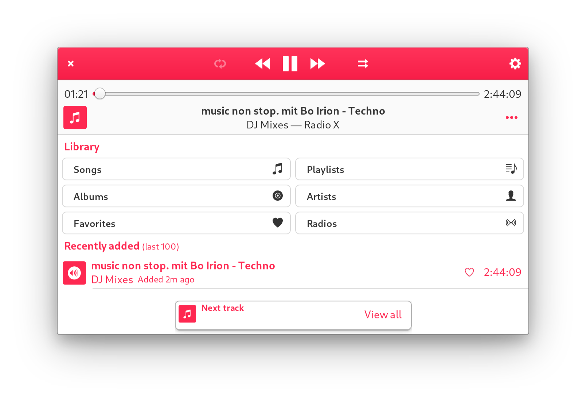

# Radio X record

Records the nightly DJ mix program [x-fade](http://radiox.de/sendungen/x-fade-die-dj-nacht) of
[Radio X](http://radiox.de/) so that I can listen to it the next day.

## Pre-requisites

- Go 1.23
- cron
- ffmpeg

## Build

```bash
# Build the radio-x-fade-title extractor
go build
```

## Setup

Edit your local `crontab` and run the `record.sh` script as follows:

```bash
CRON_TZ="Europe/Berlin"
00 23 * * * radio-x-fade-record/record.sh
```

You should now find a recording of last night's _x-fade_ in this folder!

## Trimming

You can use `trim.sh` to remove a few leading minutes of the nightly news broadcast  preceding the radio show.

```bash
$ ./trim.sh
Usage: ./trim.sh <mp3> <time>

Remove the given amount of time (HH:MM:SS format) from the
beginning of an MP3 and save it with a '_trimmed' suffix
```

